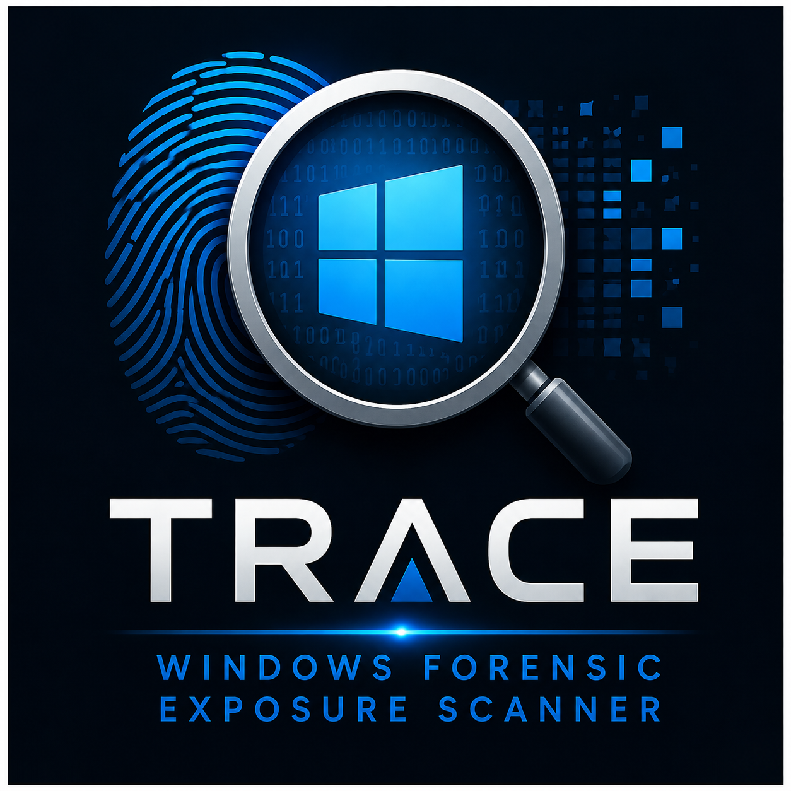

<div align="center">



# TRACE 1.0
### Total Risk Assessment & Computed Exposure

**Windows Forensic Exposure Scanner**

[](https://github.com/yonasabeselom/trace/releases)
[]()
[]()
[](LICENSE)
[]()

</div>

---

## What is TRACE?

**TRACE** (Total Risk Assessment & Computed Exposure) is a Windows forensic artifact scanner that detects, scores, and reports on **100 high-value forensic artifacts** across your system — giving you a clear picture of your digital exposure risk.

Unlike basic privacy cleaners, TRACE does not delete anything. It **scans, scores, and reports** — showing exactly what forensic evidence exists on your machine, how risky it is, and where it lives.

Every artifact is weighted and scored to produce a **final exposure score out of 100**.

---

## Features

- **100 forensic artifacts** scanned across 3 risk tiers
- **Exposure scoring** — weighted risk score computed per artifact
- **Tier classification** — HIGH / MEDIUM / LOW risk
- **PDF report export** — detailed, professionally formatted
- **Colour-coded terminal output** — real-time scan results
- **Auto-elevates to Administrator** — no manual UAC prompts needed
- **Zero dependencies** — pure Python stdlib + `reportlab` for PDF
- **Offline** — no internet connection required

---

## Artifact Coverage

| Tier | Count | Weight | Examples |
|------|-------|--------|----------|
| 🔴 HIGH | 70 | 3 pts each | AmCache, ShimCache, BAM, SRUM, USB History, LNK files, Jump Lists, Prefetch, Shellbags, MRU keys, Browser history, Windows Event Logs |
| 🟡 MEDIUM | 20 | 2 pts each | Recent docs, Thumbcache, Sticky Notes, Typed URLs, Taskbar pins, WordWheelQuery |
| 🟢 LOW | 10 | 1 pt each | Recycle Bin, Temp folders, Clipboard history, Thumbnail DB |

**Total possible score: 100** (70×3 + 20×2 + 10×1 = 270 raw points, normalized to 100)

---

## Artifact Categories

```
Registry Artifacts      Program Execution       Network & Browser
──────────────────      ─────────────────       ─────────────────
AmCache                 Prefetch files          Browser history
ShimCache               BAM/DAM database        Typed URLs
BAM registry            RecentApps              Network shares
UserAssist              CompatTelRunner         WiFi profiles
MUICache                AppCrash logs           DNS cache
RunMRU                                          RDP history

File & Storage          User Activity           Windows Logs
──────────────          ─────────────           ────────────
USB USBSTOR history     LNK shortcut files      Security event log
SRUM database           Jump Lists              System event log
Shellbags               Recent documents        PowerShell history
Thumbcache              WordWheelQuery          WER crash reports
Custom destinations     Taskbar pins            WLAN event log
Volume shadow copies    Sticky Notes
```

---

## Quick Start

### Run from source
```bash
# Requires Python 3.6+ on Windows
pip install reportlab
python TRACE.py
```

> TRACE will auto-request Administrator privileges on launch.

### Download release
Go to [Releases](https://github.com/yonasabeselom/trace/releases) and download `TRACE.exe` — no Python needed.

---

## Output

### Terminal
```
══════════════════════════════════════════════════════
  TRACE 1.0 -- Total Risk Assessment & Computed Exposure
══════════════════════════════════════════════════════
  By Yonas Abeselom | Independent Security Researcher

  [HIGH]  AmCache Registry Hive           ✓ FOUND
  [HIGH]  ShimCache / AppCompatCache      ✓ FOUND
  [HIGH]  USB USBSTOR History             ✓ FOUND
  [MED ]  Recent Documents MRU            ✓ FOUND
  [LOW ]  Recycle Bin Artifacts           ✓ FOUND
  ...

  Score: 73/100  |  HIGH: 48  MEDIUM: 16  LOW: 9
```

### PDF Report
Press **Y** when prompted to save a full PDF report to your Desktop containing:
- Cover page with exposure score
- Per-artifact results table
- Risk tier breakdown
- Timestamps and file paths

---

## Requirements

| Requirement | Detail |
|-------------|--------|
| OS | Windows 7 / 8 / 10 / 11 |
| Python | 3.6 or later (source only) |
| Privileges | Administrator (auto-requested) |
| Dependencies | `reportlab` (PDF only) |

---

## Related Projects

| Project | Description | Links |
|---------|-------------|-------|
| **TRACE** | Windows Forensic Exposure Scanner | [GitHub](https://github.com/yonasabeselom/trace) |
| **REDACT** | Windows privacy & anti-forensics tool | [GitHub](https://github.com/yonasabeselom/redact) · [SourceForge](https://sourceforge.net/projects/redact) |
| **AAD-50** | NVMe Sanitization Tool | [GitHub](https://github.com/yonasabeselom/aad50) · [SourceForge](https://sourceforge.net/projects/aad50/) |

> TRACE pairs perfectly with **REDACT** — use TRACE to find what's exposed, then use REDACT to clean it.

---

## Author

**Yonas Abeselom**  
Independent Security Researcher  
📧 yonas_abeselom@protonmail.com

---

## Disclaimer

TRACE is intended for **educational and personal security research purposes only**.  
Use only on systems you own or have explicit written permission to scan.  
The author is not responsible for any misuse of this tool.

---

## License

GNU General Public License v3.0 — see [LICENSE](LICENSE)
